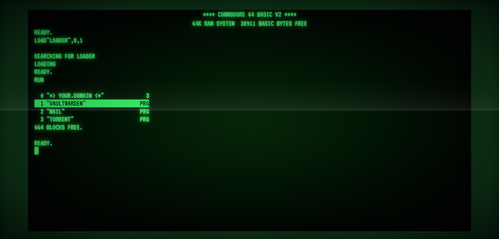

# C64 Home Server Loader

A Commodore 64 boot screen as the landing page for my home server, because the year is 2026 and we're allowed to have fun.



## What this is (and isn't)

It's a single `index.html` that loads on my home server and pretends to be a 1982 C64 booting up. The list of self-hosted services shows up as a BASIC directory listing. You launch them by clicking, by arrowing through and pressing Enter, or — if you're feeling it — by typing `LOAD"NAME",8,1` like our parents did.

It's **not** a serious project. It's a personal toy I put on my home dashboard. There's no build system, no framework, no package manager, no opinions. One HTML file and a folder of WAV samples. If you want to use it on your own server, great. If you want to fork it and add the SID chip emulation I was too lazy to write, even better.

## Features

- **Full CRT boot sequence** — power-on beam, phosphor glow, scanlines, flicker, vignette. All the cheese.
- **C64 BASIC V2 banner** with the byte counter, because what's the point otherwise.
- **Three ways to navigate the menu:**
  - **Click** a service name.
  - **Arrow up / down** to highlight, **Enter** to launch.
  - **Type the command** `LOAD"SERVICENAME",8,1` and press Enter. Case-insensitive. The trailing `,1` is optional, the spacing is forgiving — just like the real ROM.
- **Authentic C64 errors:**
  - `?SYNTAX ERROR` if you mistype the LOAD syntax
  - `?FILE NOT FOUND ERROR` if the name isn't in the directory
- **Mechanical keyboard sound** for every keystroke, with real IBM Model M samples (see [Credits](#credits)). Press and release are synced separately, so holding a key sounds like *click-..............-clack* exactly like the real thing.
- **Auto-fitting CRT frame** — the bezel shrinks itself if your menu would otherwise overflow.
- **Hidden easter egg** — see below.

## Easter egg

There's a `MUSIC` file that isn't in the visible directory. Two ways to load it:

1. Type `LOAD"MUSIC",8,1` and press Enter.
2. Input the **Konami code**: `↑ ↑ ↓ ↓ ← → ← → B A`.

If you've dropped a `music.mp3` next to `index.html`, that starts playing. If you haven't, the loader still runs but nothing happens — silent failure, no error.

## Setup

```
your-web-root/
├── index.html          ← this file
├── VT323.woff2         ← font, self-hosted (see step 2)
├── load.mp3            ← optional: tape-load sound during "SEARCHING FOR..."
├── music.mp3           ← optional: easter egg track
└── bucklespring/       ← keyboard samples (see step 3)
    ├── 01-0.wav
    ├── 01-1.wav
    ├── 02-0.wav
    ├── 02-1.wav
    └── ... (one pair per scancode)
```

### 1. Drop `index.html` in your web root

That's it. It works as-is, just with no font and no keyboard sound.

### 2. Self-host the VT323 font

The font is referenced as a local file (`VT323.woff2`) so the page keeps working if Google Fonts goes down or blocks your IP. Grab the file once:

```sh
curl -L -o VT323.woff2 'https://fonts.gstatic.com/s/vt323/v18/pxiKyp0ihIEF2hsY.woff2'
```

That's ~20 KB. If you care about prehistoric browsers (IE11), also grab the TTF as a fallback — it's referenced in the `@font-face` `src` list:

```sh
curl -L -o VT323.ttf 'https://fonts.gstatic.com/s/vt323/v18/pxiKyp0ihIEF2hsY.ttf'
```

The font is licensed **SIL Open Font License 1.1**, see [Credits](#credits).

### 3. Add the bucklespring samples

To get the IBM Model M keyboard sound, you need the WAV samples from the [bucklespring](https://github.com/zevv/bucklespring) project:

```sh
git clone https://github.com/zevv/bucklespring.git tmp
mkdir bucklespring
cp tmp/wav/*.wav bucklespring/
rm -rf tmp
```

The full set is ~10 MB across ~340 files. The page preloads them once at boot; subsequent navigation hits the browser cache, so this is a one-time cost.

If you want to slim it down, you only need the scancodes referenced in the `SCAN` map at the bottom of `index.html` — typically ~190 files, ~5 MB.

> **Important:** the WAV files are **GPL-2.0**. See [Licensing](#licensing) below.

### 4. Edit the JSON config

Near the bottom of `index.html`, there's a JSON block describing your services:

```json
{
  "bannerName": "YOUR.DOMAIN",
  "blocksFree": 664,
  "links": [
    { "name": "VAULTWARDEN", "url": "https://vault.example.com" },
    { "name": "MAIL",        "url": "https://mail.example.com"  },
    { "name": "TORRENT",     "url": "https://torrent.example.com" }
  ]
}
```

- `bannerName` — the centred header line above the directory listing.
- `blocksFree` — the "BLOCKS FREE." footer count. Decorative, pick whatever number you like (the original C64 had 664 free blocks on a fresh disk).
- `links` — your services. `name` is short, uppercase A–Z (it's what you'll type after `LOAD"`). `url` opens in a new tab.

### 5. (Optional) tape-load sound

Drop a `load.mp3` next to `index.html` and it plays during the `SEARCHING FOR... LOADING... READY.` sequence. Pick something tape-deck-y; the original Datasette sound works great.

### 6. (Optional) easter-egg music

Drop a `music.mp3` next to `index.html` for the music easter egg.

## Configuration knobs in the HTML

A few constants worth knowing about, all near the top of their respective `<script>` blocks:

| What | Where | What it does |
| --- | --- | --- |
| `MASTER_VOLUME` | keyboard-sound block | Keyboard click volume, 0.0–1.0 |
| `WAV_PATH`      | keyboard-sound block | Path to the bucklespring folder |
| `SCAN`          | keyboard-sound block | Browser key → bucklespring scancode map. Remove entries to skip sounds for those keys (and avoid loading their wavs) |
| `--frame-thick` | CSS `:root`          | Default bezel thickness; JS auto-shrinks if the menu doesn't fit |
| Phosphor colors | CSS `:root`          | `--phosphor`, `--phosphor-bright`, etc. — change them if you want amber or paper-white phosphor |

## Browser support

Anything modern (~2020+). Specifically:

- Web Audio API (for the keyboard sounds)
- CSS container queries (for auto-fitting the terminal text size)
- `fetch`, ES2017, `Map`, modern JS
- Chromium, Firefox, Safari all work

The keyboard sound needs a first user gesture before audio is allowed — that's a browser autoplay policy thing, not the script. The first key you press unlocks it.

Mobile works but the menu is keyboard-centric — touch users get click-to-launch, which is fine.

## Credits

None of this would exist without other people's hard work:

- **[Bucklespring](https://github.com/zevv/bucklespring)** by Ico Doornekamp — the actual IBM Model M keyboard samples in `bucklespring/`. Every key was carefully sampled from a real Model M. Licensed **GPL-2.0**.
- **VT323** font by Peter Hull — the chunky monospace that approximates the C64's character ROM. Originally from Google Fonts, **self-hosted in this repo** so the page survives Google Fonts going down. Licensed **SIL Open Font License 1.1**.
- **Commodore Business Machines** for designing the C64 in 1982. The `READY.`, `SEARCHING FOR`, `LOAD"..."`, `?SYNTAX ERROR`, and `?FILE NOT FOUND ERROR` strings are faithfully recreating the original ROM output. Nostalgia is doing all the heavy lifting here.

## Licensing

This is a mixed-license project — please respect it if you fork or redistribute:

- **The HTML / CSS / JS** in `index.html`: **MIT**. Do what you want, attribution appreciated, see [`LICENSE`](LICENSE).
- **The bucklespring WAV files** in `bucklespring/`: **GPL-2.0**. They're not mine to relicense. If you redistribute them, you must comply with GPL-2.0 — keep the credit, keep the license text. A copy of the GPL-2.0 text lives in [`LICENSE.bucklespring`](LICENSE.bucklespring), or grab the canonical version from [the FSF](https://www.gnu.org/licenses/old-licenses/gpl-2.0.txt).
- **The VT323 font** (`VT323.woff2` / `VT323.ttf`): **SIL Open Font License 1.1**. Self-hosted in this repo. OFL allows unrestricted redistribution alongside any kind of software as long as the font itself isn't sold standalone. The full license text lives at [scripts.sil.org/OFL](https://scripts.sil.org/OFL).

GPL-2.0 and MIT are compatible here because the two are kept in separate files — the HTML doesn't "derive from" the WAV files in any meaningful sense, they're loaded at runtime. This is the "mere aggregation" case the GPL explicitly allows. Don't strip the bucklespring credit from your fork and you're fine.

## Why

Because my home server's dashboard was a boring `<ul>` of `<a>` tags and I have too much free time. Now when I open it I get a 30-year-old computer welcoming me, and the keys click. It's silly and I love it. If it makes you smile too, mission accomplished.

---

> **Note:** I built this for one specific home server. The default `bannerName` and the placeholder URLs in the config point at my domain. If you fork it without changing them, you'll be launching links to a server you don't own. Maybe edit the JSON first.
